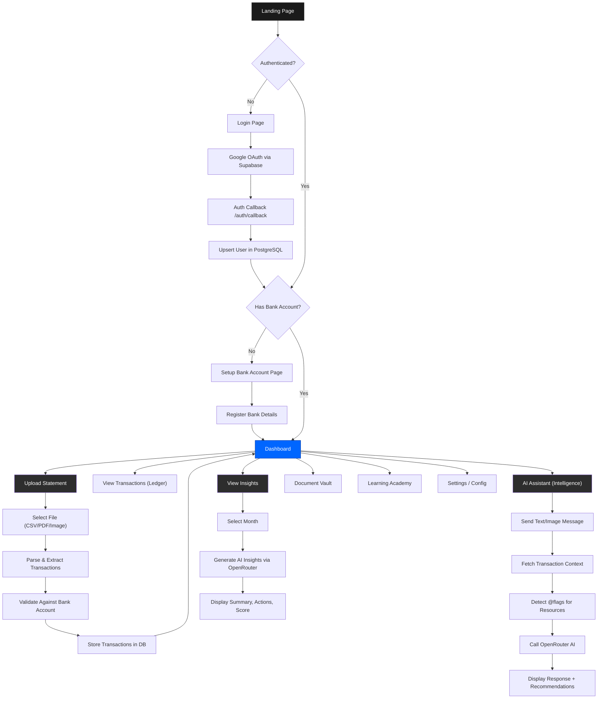
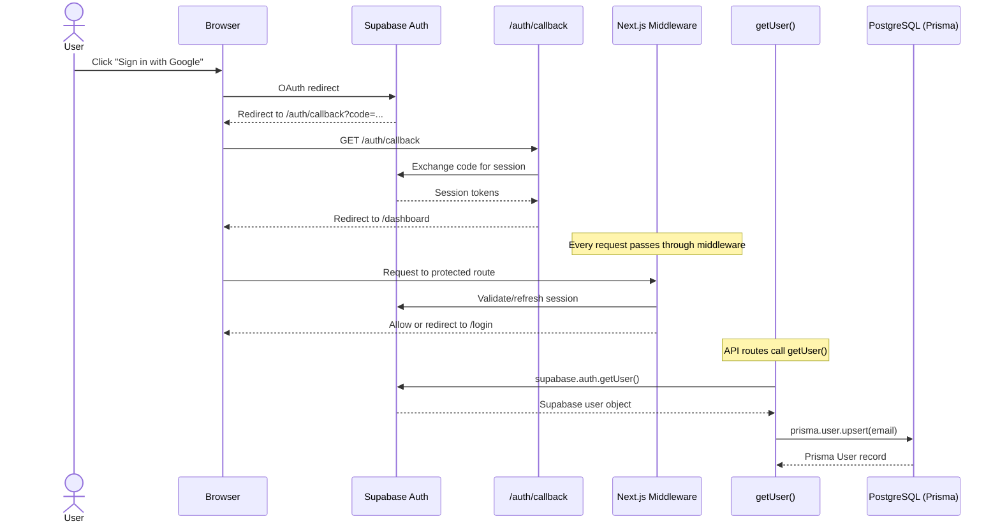
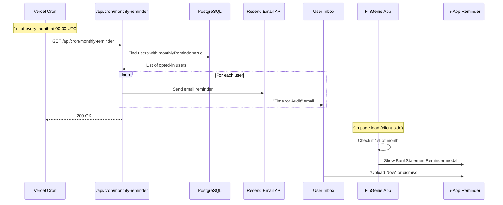
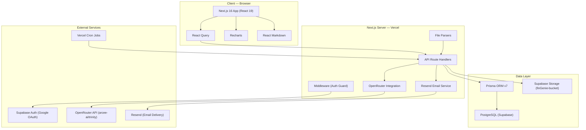
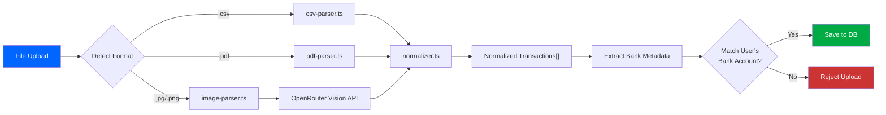
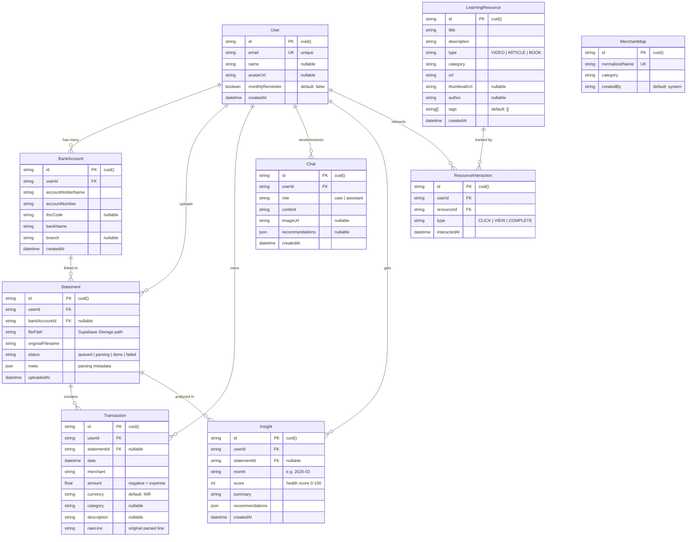
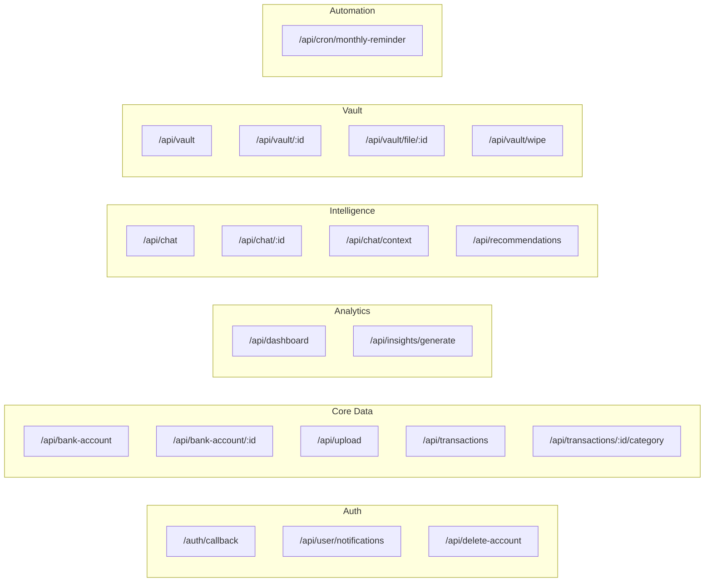
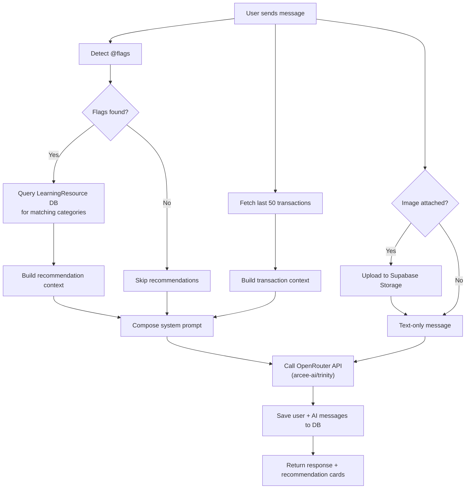
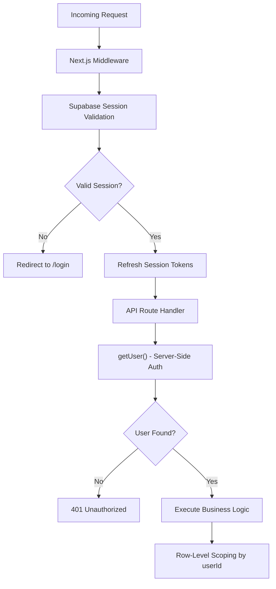
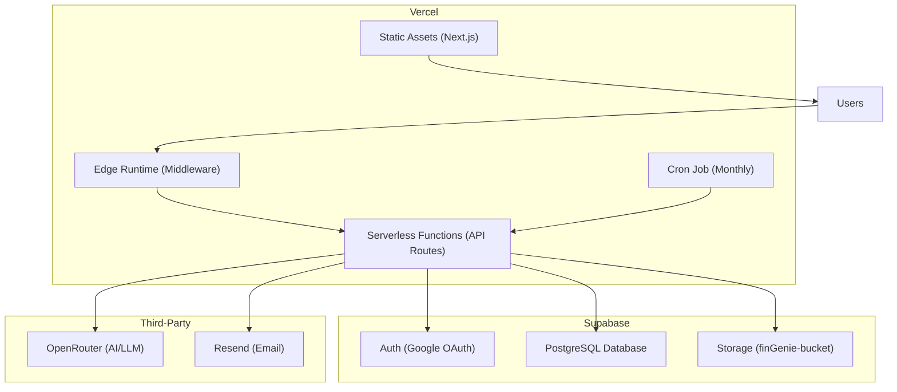

# FinGenie — Technical Documentation

> **FinGenie** is an AI-powered personal finance operating system for young adults (18–24) in India. Users upload bank statements, receive AI-driven spending insights, chat with an intelligent financial assistant, and access curated learning resources—all through a brutalist-editorial UI.

---

## Table of Contents

1. [User Flow](#1-user-flow)
2. [System Architecture](#2-system-architecture)
3. [Database Schema](#3-database-schema)
4. [API Route Map](#4-api-route-map)
5. [Core Feature Deep Dives](#5-core-feature-deep-dives)
6. [Technical Specifications](#6-technical-specifications)
7. [Security Model](#7-security-model)
8. [Deployment Architecture](#8-deployment-architecture)

---

## 1. User Flow

### 1.1 End-to-End User Journey



### 1.2 Authentication Flow



### 1.3 Monthly Reminder Flow



---

## 2. System Architecture

### 2.1 High-Level Architecture



### 2.2 File Parsing Pipeline



---

## 3. Database Schema

### 3.1 Entity-Relationship Diagram



### 3.2 Key Database Design Decisions

| Decision | Rationale |
|---|---|
| **User ID = Supabase Auth ID** | The `user.id` in Prisma is set to the Supabase auth user ID via `getUser()` upsert, ensuring a 1:1 mapping. |
| **Negative amounts = expenses** | Transactions with `amount < 0` are treated as expenses. Positive amounts in expense categories are also caught (legacy data handling). |
| **Composite unique on BankAccount** | `@@unique([userId, accountNumber])` prevents a user from registering the same account twice. |
| **Statement to BankAccount linking** | Bank account is auto-matched during upload by checking extracted account number against registered accounts. |
| **MerchantMap for normalization** | A lookup table that maps raw merchant strings to clean names and categories, used during CSV/PDF parsing. |
| **JSON fields for flexibility** | `Statement.meta`, `Chat.recommendations`, `Insight.recommendations` store variable-structure data without schema migration. |
| **Indexes on foreign keys + date** | All `userId` FKs and `Transaction.date` are indexed for fast filtered queries by user and time range. |

---

## 4. API Route Map

### 4.1 Route Overview



### 4.2 Detailed Route Table

| Route | Method | Description |
|---|---|---|
| `/auth/callback` | GET | Exchanges OAuth code for Supabase session, redirects to dashboard |
| `/api/user/notifications` | GET/PUT | Read and update user notification preferences (`monthlyReminder`) |
| `/api/delete-account` | DELETE | Permanently deletes user account and all associated data |
| `/api/bank-account` | GET/POST | List user's bank accounts; register a new bank account |
| `/api/bank-account/[id]` | PUT/DELETE | Update or remove a specific bank account |
| `/api/upload` | POST | Upload bank statement (CSV/PDF/Image), parse, validate, and store transactions |
| `/api/transactions` | GET | Fetch transactions with month and bank account filters |
| `/api/transactions/[id]/category` | PATCH | Update the category of a specific transaction |
| `/api/dashboard` | GET | Aggregated analytics: totals, categories, daily timeline, merchants, health score, recommendations |
| `/api/insights/generate` | GET/POST | GET = fetch saved insights; POST = generate new AI insights for a month |
| `/api/chat` | GET/POST | GET = fetch chat history; POST = send message, get AI response |
| `/api/chat/[id]` | DELETE | Delete a specific chat message |
| `/api/chat/context` | GET | Fetch contextual data for the chat (e.g. specific transaction/merchant details) |
| `/api/recommendations` | GET/POST | GET = browse learning resources; POST = track interaction (CLICK/VIEW/COMPLETE) |
| `/api/vault` | GET | List all uploaded statements with transaction counts |
| `/api/vault/[id]` | DELETE | Delete a specific statement and its transactions |
| `/api/vault/file/[id]` | GET | Download the original uploaded file from Supabase Storage |
| `/api/vault/wipe` | DELETE | Wipe all statements and transactions for the user |
| `/api/cron/monthly-reminder` | GET | Vercel cron endpoint — sends email reminders to opted-in users on the 1st of each month |

---

## 5. Core Feature Deep Dives

### 5.1 Statement Upload & Parsing Pipeline

The upload system supports **three file formats**, each with a dedicated parser:

| Format | Parser | Method |
|---|---|---|
| **CSV** | `csv-parser.ts` | PapaParse library; detects column headers dynamically |
| **PDF** | `pdf-parser.ts` | `pdf-parse` library; extracts text and applies regex patterns for Indian bank statements |
| **Image** (JPG/PNG) | `image-parser.ts` | Sends base64 to OpenRouter Vision API for OCR, then normalizes extracted text |

**Validation rules:**
- Max file size: **5 MB**
- Allowed extensions: `.csv`, `.pdf`, `.jpg`, `.jpeg`, `.png`
- If bank account metadata is extracted, it must match a registered account — otherwise the upload is **rejected**

### 5.2 AI-Powered Chat Assistant



**@flag system:** Users can type `@tax`, `@investing`, `@budgeting`, etc. in their message to trigger curated learning resource recommendations alongside the AI response.

### 5.3 Dashboard Analytics Engine

The dashboard API computes the following in real-time from raw transactions:

| Metric | Computation |
|---|---|
| **Total Spent** | Sum of `abs(amount)` for all expense transactions |
| **Category Breakdown** | Grouped sum by `category` field |
| **Daily Timeline** | Grouped sum by date for the Recharts line chart |
| **Top Merchants** | Top 10 merchants by total spend |
| **Recurring Payments** | Detected via `normalizer.ts` — merchants appearing 2+ times with similar amounts |
| **Health Score (0-100)** | Weighted composite: spending variability (30%), category diversity (30%), subscription burden (40%) |
| **Recommendations** | Top 3 unwatched `LearningResource` entries matching the user's top spending category |

### 5.4 Learning Resource Engine

- Resources are seeded via `scripts/seed-resources.ts` with curated financial education content
- Categories: Tax, Finance, Investing, Budgeting, Savings, Insurance, Spending
- Types: VIDEO, ARTICLE, BOOK
- User interactions (CLICK, VIEW, COMPLETE) are tracked in `ResourceInteraction`
- The system **deprioritizes already-watched content** in both dashboard and chat recommendations

---

## 6. Technical Specifications

### 6.1 Technology Stack

| Layer | Technology | Version |
|---|---|---|
| **Framework** | Next.js (App Router) | 16.1.6 |
| **Language** | TypeScript | ^5 |
| **UI Library** | React | 19.2.3 |
| **Styling** | TailwindCSS | ^4 |
| **ORM** | Prisma Client | ^7.5.0 |
| **Database** | PostgreSQL | via Supabase |
| **Auth** | Supabase Auth (`@supabase/ssr`) | ^0.9.0 |
| **State Management** | React Query (`@tanstack/react-query`) | ^5.90 |
| **Charts** | Recharts | ^3.8.0 |
| **Markdown Rendering** | react-markdown + remark-gfm | ^10.1 / ^4.0 |
| **AI/LLM** | OpenRouter API | arcee-ai/trinity-large-preview:free |
| **Email** | Resend | ^6.9.4 |
| **File Parsing** | PapaParse (CSV), pdf-parse (PDF) | ^5.5 / ^2.4 |
| **Icons** | Lucide React | ^0.577 |
| **Deployment** | Vercel | Edge + Serverless |
| **Cron** | Vercel Cron | `0 0 1 * *` (monthly) |

### 6.2 Project Structure

```
FinGenie/
├── prisma/
│   └── schema.prisma              # 8 models, PostgreSQL
├── scripts/
│   └── seed-resources.ts          # Learning resource seeder
├── src/
│   ├── app/
│   │   ├── (protected)/           # Auth-gated pages
│   │   │   ├── dashboard/         # Main analytics dashboard
│   │   │   ├── assistant/         # AI chat (Intelligence)
│   │   │   ├── upload/            # Statement upload (Registry)
│   │   │   ├── transactions/      # Transaction list (Ledger)
│   │   │   ├── vault/             # Document storage (Vault)
│   │   │   ├── insights/          # AI insights page
│   │   │   ├── academy/           # Learning resources
│   │   │   ├── settings/          # Accounts, Notifications, Privacy
│   │   │   ├── setup-bank/        # Bank account registration
│   │   │   └── layout.tsx         # Sidebar nav, BankProvider
│   │   ├── api/                   # 19 API route files
│   │   ├── auth/callback/         # OAuth callback handler
│   │   ├── login/                 # Login page
│   │   └── page.tsx               # Landing page
│   ├── components/
│   │   ├── AccountSwitcher.tsx    # Multi-account dropdown
│   │   ├── BankStatementReminder  # Monthly popup reminder
│   │   ├── Logo.tsx               # Brand logo component
│   │   └── RecommendationCards    # Learning resource cards
│   ├── lib/
│   │   ├── auth.ts                # getUser() — Supabase to Prisma upsert
│   │   ├── prisma.ts              # Prisma client singleton
│   │   ├── openrouter.ts          # AI API integration
│   │   ├── email.ts               # Resend email utility
│   │   ├── parsers/               # CSV, PDF, Image, Normalizer
│   │   ├── supabase/              # Client, server, middleware helpers
│   │   └── contexts/              # BankContext (React context)
│   ├── providers/
│   │   └── query-provider.tsx     # React Query provider
│   └── middleware.ts              # Session refresh on every request
└── vercel.json                    # Cron job configuration
```

### 6.3 Environment Variables

| Variable | Purpose |
|---|---|
| `NEXT_PUBLIC_SUPABASE_URL` | Supabase project URL |
| `NEXT_PUBLIC_SUPABASE_ANON_KEY` | Supabase anonymous key (client-side) |
| `SUPABASE_SERVICE_ROLE_KEY` | Supabase service role key (server-side) |
| `DATABASE_URL` | PostgreSQL connection string with pooling |
| `DIRECT_URL` | Direct PostgreSQL connection (for migrations) |
| `OPENROUTER_API_KEY` | OpenRouter API key for AI features |
| `RESEND_API_KEY` | Resend API key for email delivery |
| `NEXT_PUBLIC_APP_URL` | Deployed app URL for email links |
| `CRON_SECRET` | Secret token to authenticate cron requests |

---

## 7. Security Model



**Key security measures:**

- **Authentication:** Google OAuth via Supabase — no password storage
- **Session management:** Supabase SSR cookies, refreshed on every request via middleware
- **API authorization:** Every API route calls `getUser()` which validates the Supabase session server-side and returns the Prisma user
- **Row-level data isolation:** All database queries are scoped with `userId: user.id`
- **File upload validation:** 5 MB limit, allowlisted extensions only
- **Bank account verification:** Uploaded statements are cross-checked against registered bank account numbers
- **Cron authentication:** Monthly reminder endpoint is protected by a `CRON_SECRET` token
- **Cascade deletes:** Deleting a user cascades to all related data (bank accounts, statements, transactions, chats, insights, interactions)

---

## 8. Deployment Architecture



**Deployment details:**
- **Hosting:** Vercel (automatic deployments from Git)
- **Database:** Supabase-managed PostgreSQL with connection pooling via `@prisma/adapter-pg`
- **File storage:** Supabase Storage bucket `finGenie-bucket` for uploaded statements and chat images
- **CDN:** Vercel Edge Network for static assets and middleware execution
- **Cron schedule:** `0 0 1 * *` — runs on the 1st of every month at midnight UTC
